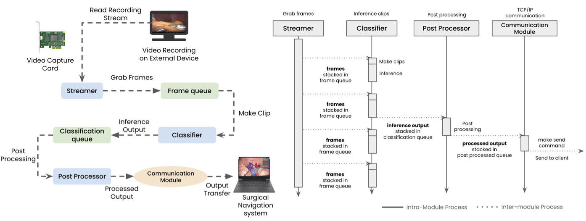
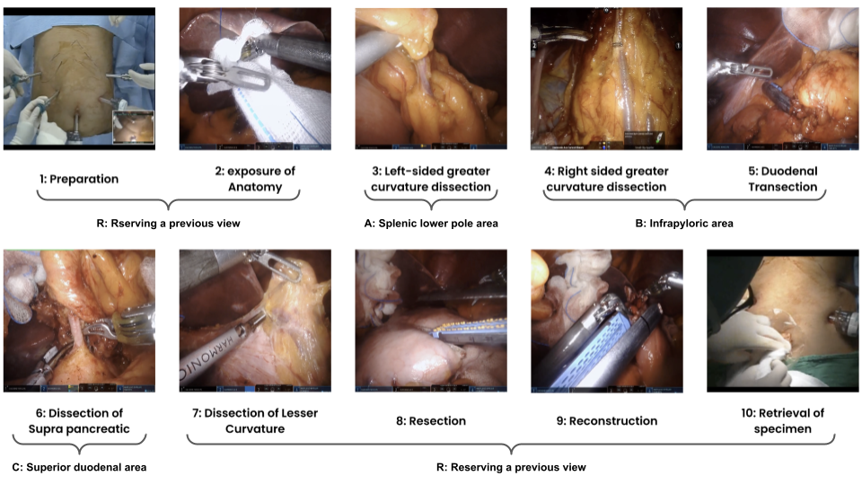
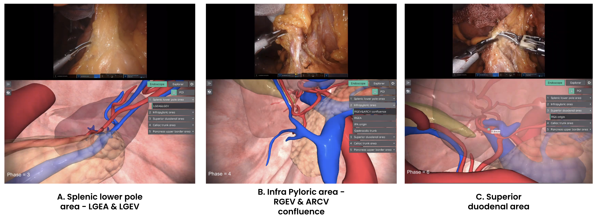
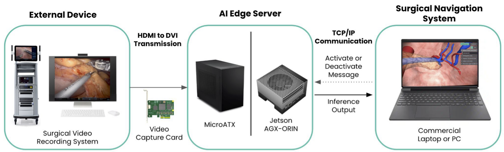
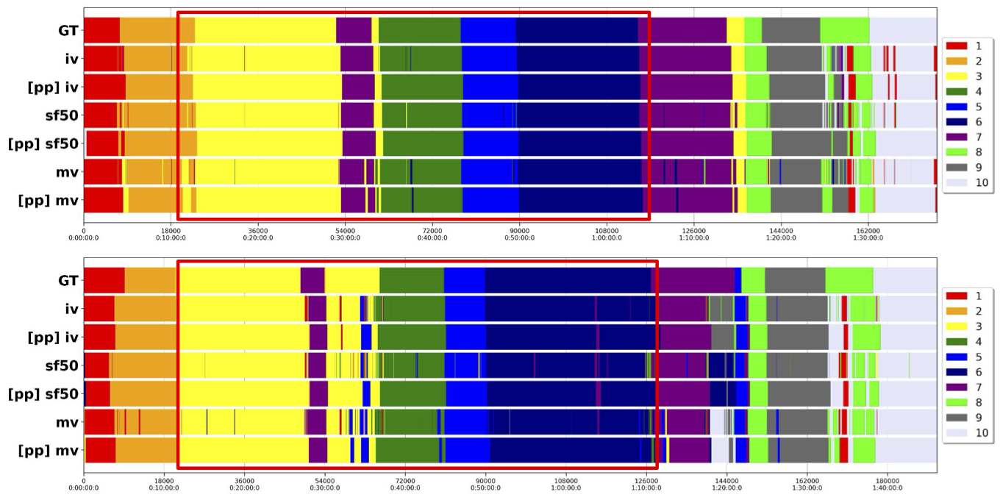

# SP-NAS: Surgical Phase Recognition-based Navigation Adjustment System for Distal Gastrectomy

🎉 **Published in Applications of Medical Artificial Intelligence: Third International Workshop, AMAI 2024, Held in Conjunction with MICCAI 2024.** 🎉
→ [[**PDF**]](https://link.springer.com/chapter/10.1007/978-3-031-82007-6_4)

## 1. Overview

**SP-NAS** is a novel **Surgical Phase Recognition-based Navigation Adjustment System** designed to enhance **distal gastrectomy** procedures. By recognizing ten defined surgical phases in real time, SP-NAS automatically adjusts a 3D anatomical model to highlight the critical anatomical structures relevant for each phase. This system helps surgeons avoid manual camera manipulations or complex external tracking, streamlining the surgical workflow.

> **Key Contributions**  
> 1. **Workflow-based Navigation**: Real-time recognition of the current surgical phase triggers an appropriate 3D reference view, eliminating the need for continuous manual viewpoint adjustment.  
> 2. **Extensive Benchmarking**: We compare multiple state-of-the-art action recognition models (SlowFast, MoViNet, and InternVideo) on 146 robotic distal gastrectomy cases using a 6-fold cross-validation scheme.  
> 3. **High Clinical Relevance**: Achieves near real-time inference on both desktop-class GPUs and AI edge devices (e.g., Jetson AGX Orin), facilitating immediate integration into real OR environments.

**Figure 1**: *High-Level SP-NAS Architecture* – A concise diagram showing the four modules: Streamer, Classifier, Post-processor, and Communication Module.

## 2. Motivation

Navigating complex **minimally invasive surgeries** often requires surgeons to reference preoperative patient-specific 3D models. However, continuously updating these models by hand is impractical. Our **SP-NAS** sidesteps these challenges by focusing on **workflow-based view adjustments**:

- **Sequential Nature** of Distal Gastrectomy: Each phase (e.g., greater curvature dissection, duodenal transection) has distinct anatomical targets.  
- **3D Model Reference Views**: We predefine three major vantage points (A, B, and C) mapped to relevant anatomical structures and blood vessels, automatically selected based on phase recognition.

## 3. Method

### 3.1 Surgical Phase Classification

We define **ten distinct phases** for distal gastrectomy (Preparation, Exposure of Anatomy, Dissection of Greater Curvature, Duodenal Transection, etc.), and **three 3D model reference views** (A: Splenic lower pole area, B: Infrapyloric area, C: Superior duodenal area).

**Figure 2**: *Surgical Phase and Reference View Definitions*

Our classifier leverages **representative action recognition models**:
- **SlowFast** (ResNet-50 backbone)  
- **MoViNet** (A0 configuration)  
- **InternVideo** (ViT-B backbone)

Each model processes short video clips (e.g., 4–16 frames) extracted at 1 FPS, then outputs a predicted phase in real time.

### 3.2 Navigation Adjustment

For each recognized phase, the system automatically **rotates/zooms/pans** the patient’s 3D anatomical model to the appropriate reference viewpoint. In practice:
1. The **Post-processor** enforces stability, smoothing out transient misclassifications. 

$$
C^*=C_t \quad \text { if } \quad C_t=C_{t+1}=\cdots=C_{t+N-1}, \forall t \in[1, T-N+1] .
$$

where $C_t$ denotes a surgical phase class at timestamp $t$, $N$ denotes a certain period of time for stability.

2. The **Communication Module** sends the final recognized phase to the navigation software, which changes the 3D model view accordingly.

**Figure 3**: *Navigation System Diagram* – Show how SP-NAS connects to a standard surgical navigation platform, detailing the networking or interface components.

## 4. Experiments

We collected **146 robotic distal gastrectomy** videos (IRB-approved) and partitioned them in a 6-fold manner: 110 for training, 22 for validation, 14 for testing. A total of **10 surgical phases** were annotated by expert surgeons.

### 4.1 Quantitative Results

We benchmarked three models across different input clip sizes (`4`, `8`, or `16` frames) and different hardware settings (desktop GPUs vs. embedded AI boards). Below is a **sample** of the results (more in the paper):

| Model               | Input (Frames) | Accuracy (Test) | Latency (ms) | 
|---------------------|----------------|-----------------|--------------|
| SlowFast (R50)      | 16             | **85.86%**      | 23.19 (RTX2060) |
| MoViNet-A0          | 16             | 84.13%          |  5.99 (RTX2060) |
| InternVideo (ViT-B) | 16             | **87.29%**      | 96.76 (RTX2060) |

**Observations**:  
- **InternVideo** attains the highest accuracy but with higher latency.  
- **MoViNet-A0** trades off some accuracy for significantly lower compute time.  
- Simple **post-processing** (phase stabilization) adds up to ~2% improvement across all models.

### 4.2 Qualitative Analysis

**Figure 4**: *Phase Timeline Visualization* – Show the ground-truth phase timeline vs. predicted timeline for a high-performing test case and a more challenging one. iv stands for InterVideo, sf stands for SlowFast, and mv stands for MoViNet. pp stands for post-processing.

## 5. Demo Video

Check out our **demo video** to see SP-NAS in action:

1. **Phase Recognition**: The bottom panel displays real-time classification results for each incoming video frame.  
2. **3D Navigation**: The top panel shows how the reference 3D model instantly updates to highlight key vessels and organs relevant to the current phase.

## 6. Conclusion and Future Work

We proposed **SP-NAS**, a software-only framework that unifies **workflow-based navigation adjustment** with **surgical phase recognition**. Our results demonstrate **robust performance** under various conditions:

- **Practical Implementation**: SP-NAS is easy to integrate into existing laparoscopic or robotic setups.  
- **Scalability**: No specialized tracking hardware is needed, making it cost-effective for broad deployment.

**Next Steps**:
- **Multi-Center Study**: Validate across different hospitals with diverse patient populations.  
- **Extension to Laparoscopic Gastrectomy**: Laparoscopic procedures often have dynamic camera motions, challenging the phase recognition.  
- **Combining with Other Modalities**: Explore adding AR overlays to further enhance user experience.

## References

1. **Feichtenhofer, C.**, et al. “SlowFast Networks for Video Recognition.” *ICCV, 2019.*  
2. **Kondratyuk, D.**, et al. “MoViNets: Mobile Video Networks for Efficient Video Recognition.” *CVPR, 2021.*  
3. **Wang, Y.**, et al. “InternVideo: General Video Foundation Models via Generative and Discriminative Learning.” *ArXiv, 2022.*  

## Contact

For further inquiries or collaboration opportunities, please reach out:
- **Email**: [hyeongyuc96@hutom.io ](mailto:hyeongyuc96@hutom.io ), [yjh2020@hutom.io](mailto:yjh2020@hutom.io)
- **Institution**: Hutom, Seoul, Republic of Korea
